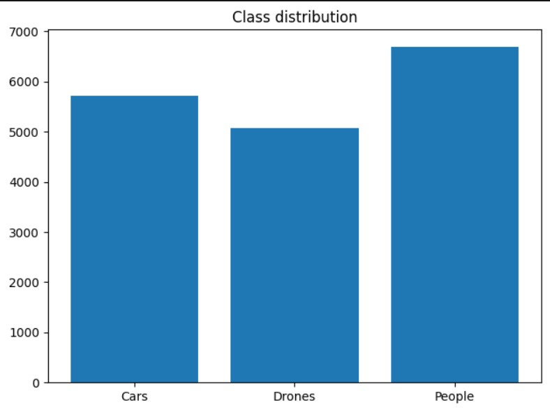
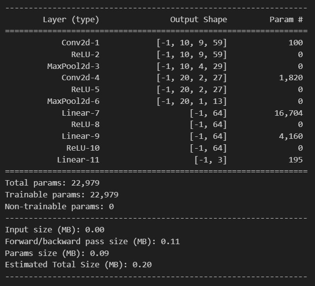

Object-Classification-using-Radar-Images.

Frequency-Modulated Continuous-Wave (FMCW) radar is a type of radar sensor capable of determining the target distance and speed by comparing the transmitted signal with the one reflected.

In a nutshell, the radar processor performs two consecutive Fast Fourier Transform (FFT) over the received signal to compute the range-Doppler map of the illuminated area. After a square-law detector, each range-Doppler map cell represents the presence of a potential target lying at the corresponding cell range and Doppler frequency which can be used to estimate its speed. If the cell value is greater than a threshold (computed to ensure a constant Probability of False Alarm) a target is detected at that cell.

In modern systems, it is often required not only to detect a target but to automatically classify it. To this end, several approaches have been developed using multiple radar features such as the target micro-Doppler signature. However, in this post, we will explore the use of a Convolutional Neural Network (CNN) to classify targets using only the information provided by the range-Doppler map.

Distrubution:
From the figure, there are:

5720 examples of cars
5065 examples of drones
6700 examples of people
For a total of 17485 examples. In addition, all classes are approximately equally represented, hence we don’t need to worry about dataset imbalance. This allows us to safely use the prediction accuracy as a metric to measure our model performance.

Now, let’s visualize individual class examples to see if we can gain more insight into the data.

MODEL:
We reduce the number of parameters from 173K to 23K and the model size from 800 KB to 200 KB. All this while improving generalization and obtaining a higher performance on the validation data.

Finally, when applying the model to the test data we obtain a nice: 94 % accuracy.

Output:
There are a couple of observations that we can make from the previous figure:

Car reflections usually take multiple cells on the y-axis direction which represents the range dimension and few on the x-axis or Doppler dimension. This is expected since cars are large targets with no moving parts.

On the other hand, drone reflections are smaller and have low power values compared to cars and people. This is also expected since drones have the smallest Radar-Cross Section (RCS) of the analyzed targets which is directly proportional to the echo power.

People’s reflections are wild ! They spread through the Doppler dimension as we a move lots of parts when walking. Take for example the movement of the arms.

In addition, people’s maps have strong side echoes (represented by a red rectangle) that take the whole range dimension. I suspect that these are clutter echoes corresponding to stationary objects in the environment, as people move relatively slowly, their echoes usually appear near the clutter. In fact, this could serve as an indicator for our model.

## Dataset
The dataset is available at:
https://www.kaggle.com/datasets/iroldan/real-doppler-raddar-database

