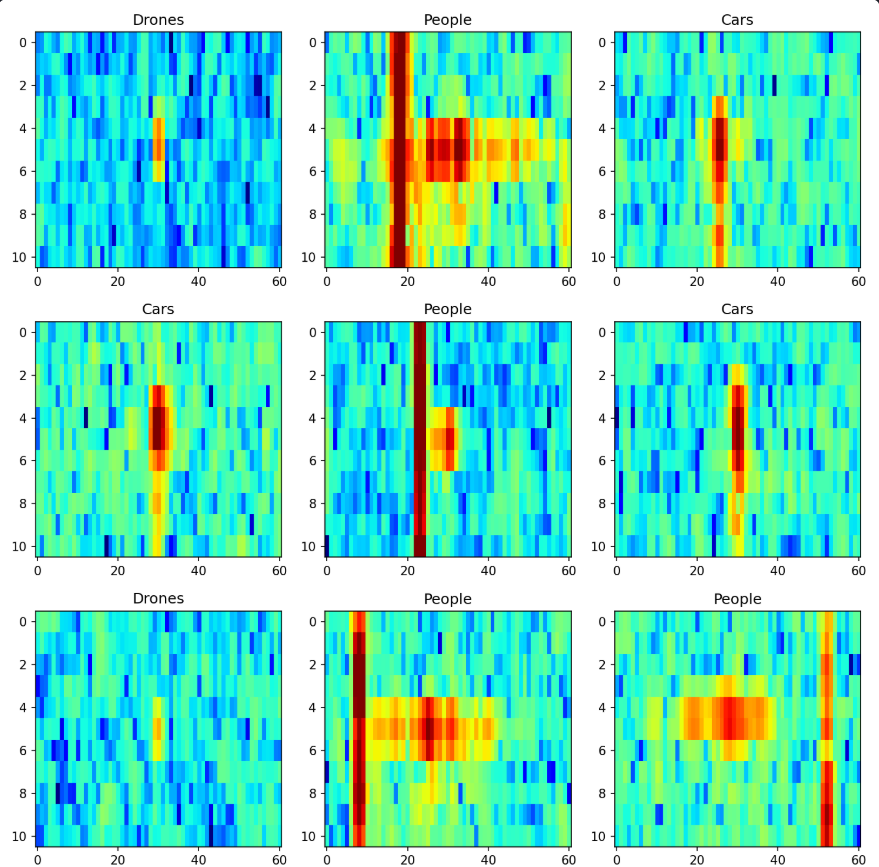

Object-Classification-using-Radar-Images.

Frequency-Modulated Continuous-Wave (FMCW) radar is a type of radar sensor capable of determining the target distance and speed by comparing the transmitted signal with the one reflected.

In a nutshell, the radar processor performs two consecutive Fast Fourier Transform (FFT) over the received signal to compute the range-Doppler map of the illuminated area. After a square-law detector, each range-Doppler map cell represents the presence of a potential target lying at the corresponding cell range and Doppler frequency which can be used to estimate its speed. If the cell value is greater than a threshold (computed to ensure a constant Probability of False Alarm) a target is detected at that cell.

In modern systems, it is often required not only to detect a target but to automatically classify it. To this end, several approaches have been developed using multiple radar features such as the target micro-Doppler signature. However, in this post, we will explore the use of a Convolutional Neural Network (CNN) to classify targets using only the information provided by the range-Doppler map.

## Dataset
The dataset is available at:
https://www.kaggle.com/datasets/iroldan/real-doppler-raddar-database

